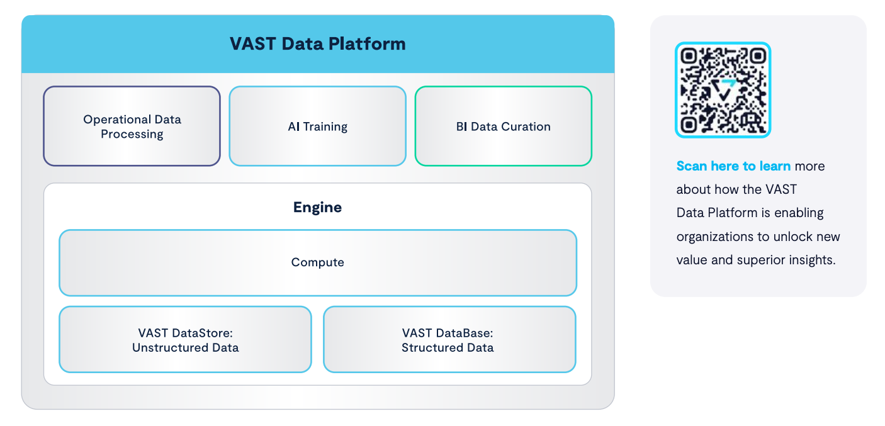

[](https://pypi.org/project/vastdb)

# VAST DB Python SDK

## Introduction

`vastdb` is a Python-based SDK designed for interacting with a [VAST Database](https://vastdata.com/database) and the [VAST Catalog](https://vastdata.com/blog/vast-catalog-treat-your-file-system-like-a-database), enabling schema and table management, efficient ingest, query, and modification of columnar data. 

For more details about the VAST Database, see [this whitepaper](https://vastdata.com/whitepaper/#TheVASTDataBase).

[](https://vastdata.com/database)

## Getting Started

### Requirements

- Linux client with Python 3.9 - 3.12, and network access to the VAST Cluster
- [Virtual IP pool configured with DNS service](https://support.vastdata.com/s/topic/0TOV40000000FThOAM/configuring-network-access-v50)
- [S3 access & secret keys on the VAST cluster](https://support.vastdata.com/s/article/UUID-4d2e7e23-b2fb-7900-d98f-96c31a499626)
- [Tabular identity policy with the proper permissions](https://support.vastdata.com/s/article/UUID-14322b60-d6a2-89ac-3df0-3dfbb6974182)

### Required VAST Cluster release

VAST DB Python SDK requires VAST Cluster release `5.0.0-sp10` or later.

If your VAST Cluster is running an older release, please contact customer.support@vastdata.com.

### Installation

```bash
pip install vastdb
```

See the [Release Notes](CHANGELOG.md) for the SDK.

### Quick Start

Create schemas and tables, basic inserts, and selects:

```python
import pyarrow as pa
import vastdb

session = vastdb.connect(
    endpoint='http://vip-pool.v123-xy.VastENG.lab',
    access=AWS_ACCESS_KEY_ID,
    secret=AWS_SECRET_ACCESS_KEY)

with session.transaction() as tx:
    bucket = tx.bucket("bucket-name")

    schema = bucket.create_schema("schema-name")
    print(bucket.schemas())

    columns = pa.schema([
        ('c1', pa.int16()),
        ('c2', pa.float32()),
        ('c3', pa.utf8()),
    ])
    table = schema.create_table("table-name", columns)
    print(schema.tables())
    print(table.columns())

    arrow_table = pa.table(schema=columns, data=[
        [111, 222, 333],
        [0.5, 1.5, 2.5],
        ['a', 'bb', 'ccc'],
    ])
    table.insert(arrow_table)

    # run `SELECT * FROM t`
    reader = table.select()  # return a `pyarrow.RecordBatchReader`
    result = reader.read_all()  # build an PyArrow Table from the `pyarrow.RecordBatch` objects read from VAST
    assert result == arrow_table

    # the transaction is automatically committed when exiting the context
```

For configuration examples, see [here](docs/config.md).

Note: the transaction must be remain open while the returned [pyarrow.RecordBatchReader](https://arrow.apache.org/docs/python/generated/pyarrow.RecordBatchReader.html) generator is being used.

## Use Cases

### Filters and Projections

The SDK supports predicate and projection pushdown:

```python
    from ibis import _

    # SELECT c1 FROM t WHERE (c2 > 2) AND (c3 IS NULL)
    table.select(columns=['c1'],
                 predicate=(_.c2 > 2) & _.c3.isnull())

    # SELECT c2, c3 FROM t WHERE (c2 BETWEEN 0 AND 1) OR (c2 > 10)
    table.select(columns=['c2', 'c3'],
                 predicate=(_.c2.between(0, 1) | (_.c2 > 10))

    # SELECT * FROM t WHERE c3 LIKE '%substring%'
    table.select(predicate=_.c3.contains('substring'))
```

See [here for more details](docs/predicate.md).

### Import a single Parquet file via S3 protocol

You can efficiently create tables from Parquet files (without copying them via the client):

```python
    with tempfile.NamedTemporaryFile() as f:
        pa.parquet.write_table(arrow_table, f.name)
        s3.put_object(Bucket='bucket-name', Key='staging/file.parquet', Body=f)

    schema = tx.bucket('bucket-name').schema('schema-name')
    table = util.create_table_from_files(
        schema=schema, table_name='imported-table',
        parquet_files=['/bucket-name/staging/file.parquet'])
```

### Import multiple Parquet files concurrently via S3 protocol

Import multiple files concurrently into a table (by using multiple CNodes' cores):

```python
    schema = tx.bucket('bucket-name').schema('schema-name')
    table = util.create_table_from_files(
        schema=schema, table_name='large-imported-table',
        parquet_files=[f'/bucket-name/staging/file{i}.parquet' for i in range(10)])
```


### Semi-sorted Projections

Create, list and delete [available semi-sorted projections](https://support.vastdata.com/s/article/UUID-e4ca42ab-d15b-6b72-bd6b-f3c77b455de4):

```python
p = table.create_projection('proj', sorted=['c3'], unsorted=['c1'])
print(table.projections())
print(p.get_stats())
p.drop()
```

### Snapshots

You can access the VAST Database using [snapshots](https://vastdata.com/blog/bringing-snapshots-to-vasts-element-store):

```python
snaps = bucket.list_snapshots()
batches = snaps[0].schema('schema-name').table('table-name').select()
```

## Post-processing

### Export

`Table.select()` returns a stream of [PyArrow record batches](https://arrow.apache.org/docs/python/data.html#record-batches), which can be directly exported into a Parquet file:

```python
batches = table.select()
with contextlib.closing(pa.parquet.ParquetWriter('/path/to/file.parquet', batches.schema)) as writer:
    for batch in table_batches:
        writer.write_batch(batch)
```

### DuckDB Integration

Use [DuckDB](https://duckdb.org/docs/guides/python/sql_on_arrow.html) to post-process the resulting stream of [PyArrow record batches](https://arrow.apache.org/docs/python/data.html#record-batches):

```python
from ibis import _

import duckdb
conn = duckdb.connect()

with session.transaction() as tx:
    table = tx.bucket("bucket-name").schema("schema-name").table("table-name")
    batches = table.select(columns=['c1'], predicate=(_.c2 > 2))
    print(conn.execute("SELECT sum(c1) FROM batches").arrow())
```

Note: the transaction must be active while the DuckDB query is executing and fetching results using the Python SDK.

## VAST Catalog

The [VAST Catalog](https://vastdata.com/blog/vast-catalog-treat-your-file-system-like-a-database) can be queried as a regular table:

```python
import pyarrow as pa
import vastdb

session = vastdb.connect(
    endpoint='http://vip-pool.v123-xy.VastENG.lab',
    access=AWS_ACCESS_KEY_ID,
    secret=AWS_SECRET_ACCESS_KEY)

with session.transaction() as tx:
    table = tx.catalog().select(['element_type']).read_all()
    df = table.to_pandas()

    total_elements = len(df)
    print(f"Total elements in the catalog: {total_elements}")

    file_count = (df['element_type'] == 'FILE').sum()
    print(f"Number of files/objects: {file_count}")

    distinct_elements = df['element_type'].unique()
    print("Distinct element types on the system:")
    print(distinct_elements)
```
## More Information

See these blog posts for more examples:

- https://vastdata.com/blog/the-vast-catalog-in-action-part-1
- https://vastdata.com/blog/the-vast-catalog-in-action-part-2

See also the [full Vast DB Python SDK documentation](https://vastdb-sdk.readthedocs.io/en/v1.1.0/)
